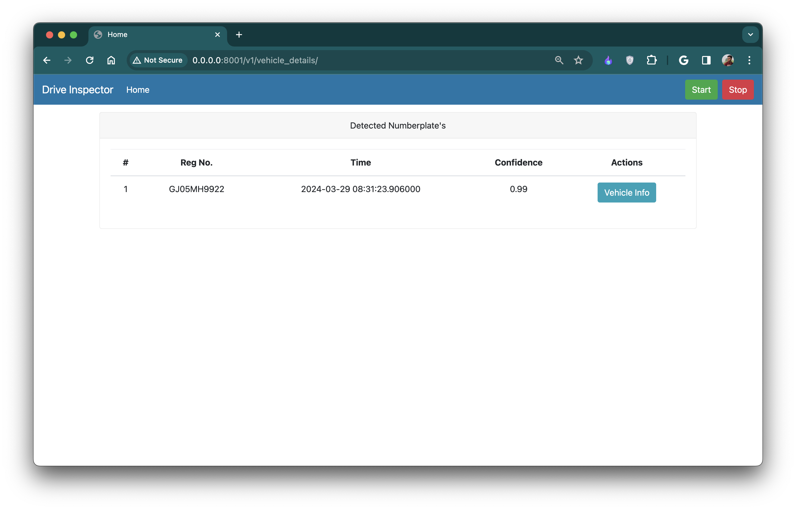
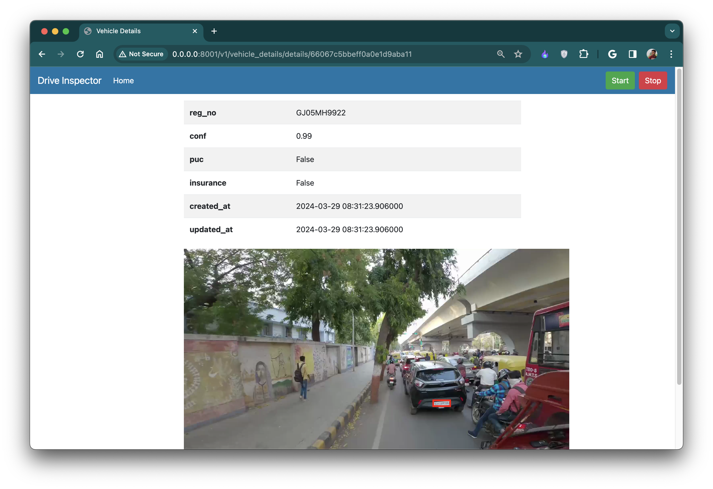
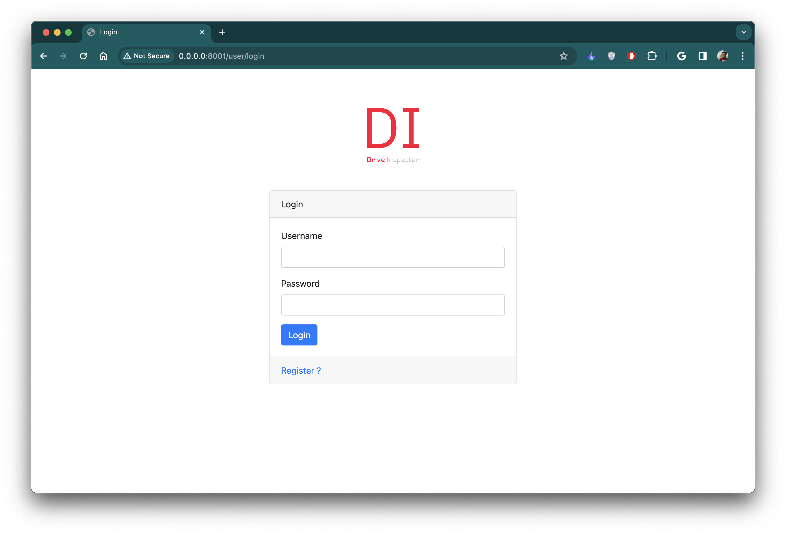
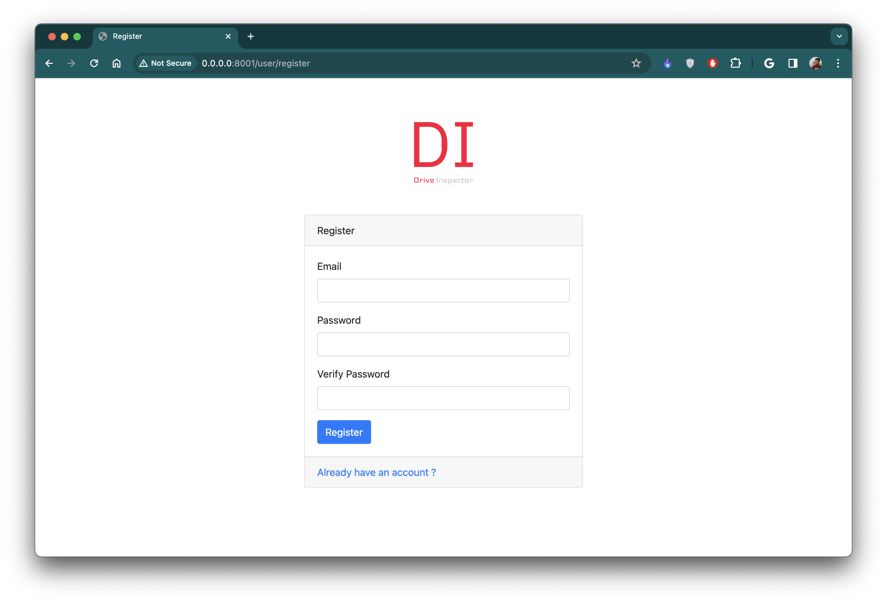

- create virtual env with `python3.10.14`
```commandline
python -m venv venv
```

- activate the venv

- install requirements.txt
```commandline
pip install -r requirements.txt
```

- change .env file like mongo url and other details

- run main.py file
```commandline
python main.py
```

go to http://localhost:8000

- testing videos `static/demo/videos`

### DEMO






#### Mongodb
```commandline
brew services start mongodb-community@7.0
```

```commandline
brew services stop mongodb-community@7.0
```